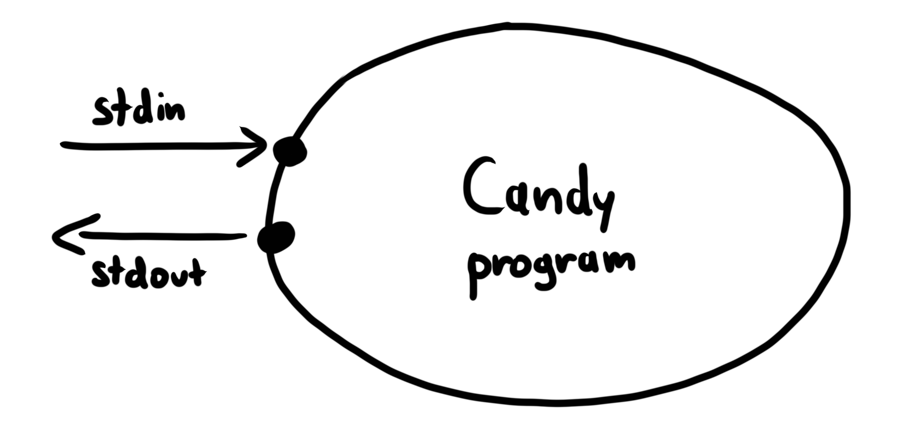

topics = [ "Candy", "programming language design", "code" ]
description = "How Candy uses structured concurrency."

--start--

# Why Candy Doesn't Have Built-In Concurrency Anymore

depends on candy-concurrency

Until recently, we supported primitives for structured concurrency in our programming language Candy.
You can find the details about the design and implementation [in the last article](candy-concurrency), but the short version is that there were built-in functions for operations such as starting multiple parallel execution threads.

We compile Candy code into bytecode for our VM.
Recently, [Clemens](https://tiedt.dev) started working on an LLVM backend as an alternative.
As part of that, we started thinking more about how Candy interacts with the platform it runs on.

--snip--

## How Candy Interacted With The World Until Now

Until now, Candy code interacts with the environment using [channels](candy-concurrency).
For example, the `main` function accepts the receive end of a stdin channel and the send end of a stdout channels.
From the perspective of the runtime, your program looks like this:


Inside your program, many fibers can run concurrently.
Implementing fibers was pretty fun – an exciting challenge that took me some time to figure out.

But why do we work on Candy in the first place?
**We want to provide amazing tooling using fuzzing.**
Our main goal is to explore this unique aspect of Candy.
Built-in concurrency can be a cool language feature, but it's not what makes Candy special.

To get back to the point:
Clemens started working on an LLVM backend.
As it turns out, having concurrency primitives in the language makes implementing a runtime *much* more complicated.
When you're compiling to machine code, adding support for multiple execution threads is difficult – it's certainly possible, but it introduces lots of complexity.
To streamline Candy development, we decided to **narrow its scope** and removed fibers and channels in favor of handles.

## Handles

Handles are a new kind of Candy value that can't be created in Candy code.
Instead, the environment passes handles to the main function.
To Candy code, handles are indistinguishable from functions – `candy:typeOf handle` returns `candy:Function` and you can call handles with arguments.

Now, `candy:stdout` is a handle that acts like a function you can call with one argument (the string to output).
`candy:stdin` is a handle that takes no arguments and returns the next input from stdin.



## What Also Improved

Removing concurrency from Candy had another upside: Code is deterministic.
Before, it was deterministic most of the time, but you could construct undeterministic programs if you really wanted to:

```candy
[channel, parallel, async] = use "Core"

flipCoin = {
  c = channel.create 2
  parallel { nursery ->
    nursery | async { c | channel.send Heads }
    nursery | async { c | channel.send Tails }
  }
  c | channel.receive
}
```

In this case, the program enters a parallel section and creates two fibers.
On of them adds `candy:Heads` to a channel, the other one `candy:Tails`.
Depending on the scheduling of the fibers, either one of them might get to run first.
Until now, the scheduler chose a random fiber, but we planned to use multiple hardware cores in the future to run the code in parallel.

Being a functional language, Candy expects functions to be deterministic.
In particular, if a function is called, it may be evaluated at compile-time.
Our concurrency primitives broke that assumption.

With handles, that story is a lot clearer:
Optimizations can do anything to the code as long as the handles given to the main function are called in the same order and with the same values.
